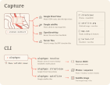
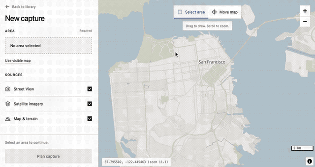

<p align="center">
  
</p>

<p align="center">
  Download a piece of the world<br>
  for you (<em>or your LLM</em>)
</p>

Aleph does two things:

- Lets you draw a rectangle on the map and downloads **everything** inside it (buildings, elevation, HD satellite imagery, Street View photos).
- Provides any of the above information for **specific points** on Earth, on the fly, via the CLI.

This was born as a way to let LLMs quickly gather information from the physical world, but you can just use it to have piece of the Earth on your laptop and do whatever you want with it.

> [!WARNING]  
> This tool uses undocumented APIs so it may break or hit rate limits.

<p align="center">
  
</p>

## Install

Requires Python 3.11+. Pillow is the only dependency. No API keys are required.

```sh
git clone https://github.com/Belluxx/Aleph.git
cd Aleph
python3 -m venv .venv
source .venv/bin/activate
python -m pip install .
```

Then test with

```sh
alephgeo --help
```

## Open the dashboard

From the dashboard you can select an area on the map and download all the data you need.

```sh
alephgeo dashboard --root captures
```

The dashboard opens in your browser at `http://127.0.0.1:8100`. Your captures will be saved in `captures`.

<p align="center">
  
</p>

## Use the CLI

Download a Street View photo or satellite image by place name:

```sh
alephgeo streetview --place "Colosseum, Rome" --best-match -o captures
alephgeo satellite --place "Colosseum, Rome" --best-match -o captures
```

`--best-match` selects the first match. Each download is saved in a new folder inside `captures`.

See the [CLI docs](docs/cli.md) for examples and details.
