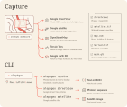

<p align="center">
  
</p>

<p align="center">
  Download a piece of the world<br>
  for you (<em>or your LLM</em>)
</p>

Aleph does two things:

- Lets you draw a rectangle on the map and downloads **everything** inside it (buildings, elevation, HD satellite imagery, Street View photos, textured 3D models).
- Provides any of the above information for **specific points** on Earth, on the fly, via the CLI.

This was born as a way to let LLMs quickly gather information from the physical world, but you can just use it to have piece of the Earth on your laptop and do whatever you want with it.

> [!WARNING]  
> This tool uses undocumented APIs so it may break or hit rate limits.

<p align="center">
  
</p>

## Install

Requires Python 3.11+. The only dependencies are Pillow and numpy. No API keys are required.

```sh
git clone https://github.com/Belluxx/Aleph.git
cd Aleph
python3 -m venv .venv
source .venv/bin/activate
python -m pip install .
```

Then test with

```sh
alephgeo --help
```

## Open the dashboard

```sh
alephgeo dashboard -o captures
```

The dashboard opens in your browser at `http://127.0.0.1:8100`. Draw a rectangle on the map, choose the sources and their settings, check the preview and time estimate, then start the capture. Open any capture to show or hide each layer, or to explore its 3D mesh or terrain relief in 3D. Captures are saved in `captures`.

The basemap comes from [OpenFreeMap](https://openfreemap.org) and needs an internet connection.

## Use the CLI

Download a Street View photo or satellite image by place name:

```sh
alephgeo streetview --place "Colosseum, Rome" --best-match -o captures
alephgeo satellite --place "Colosseum, Rome" --best-match -o captures
```

`--best-match` selects the first match. Each download is saved in a new folder inside `captures`.

See the [CLI docs](docs/cli.md) for examples and details.
